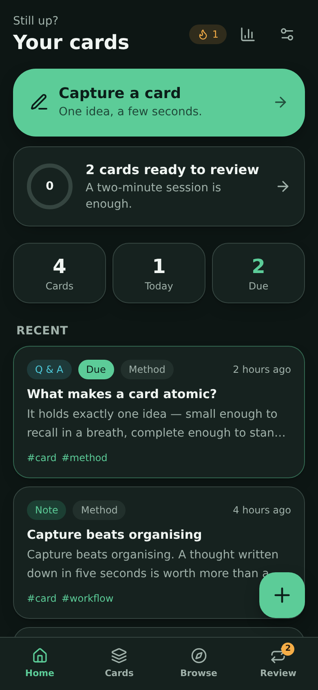
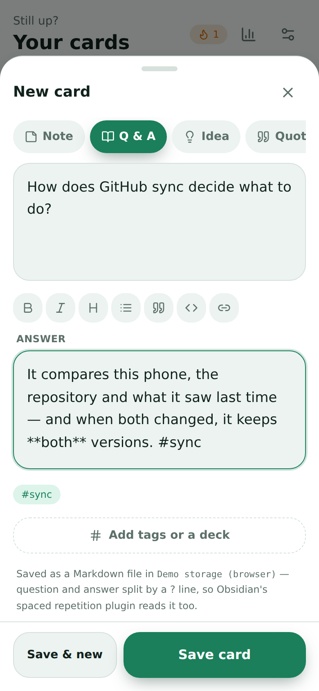
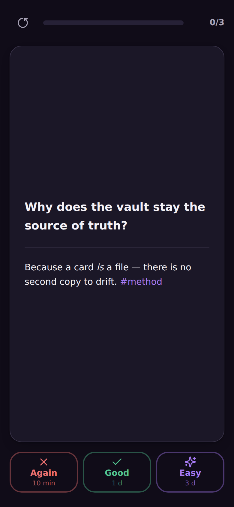
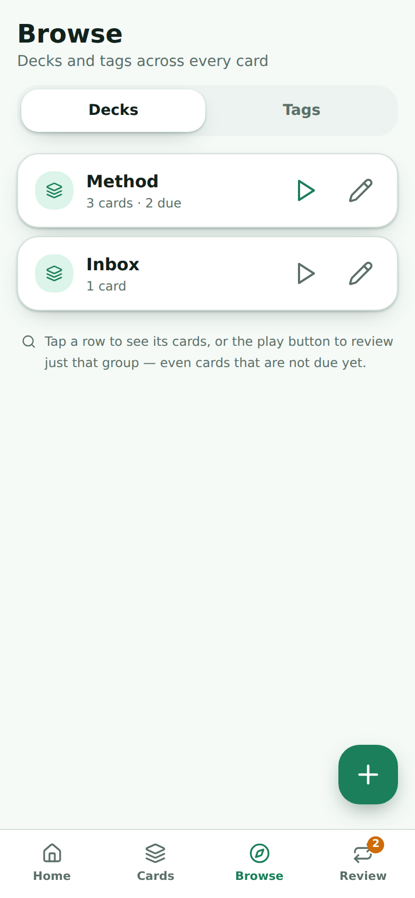
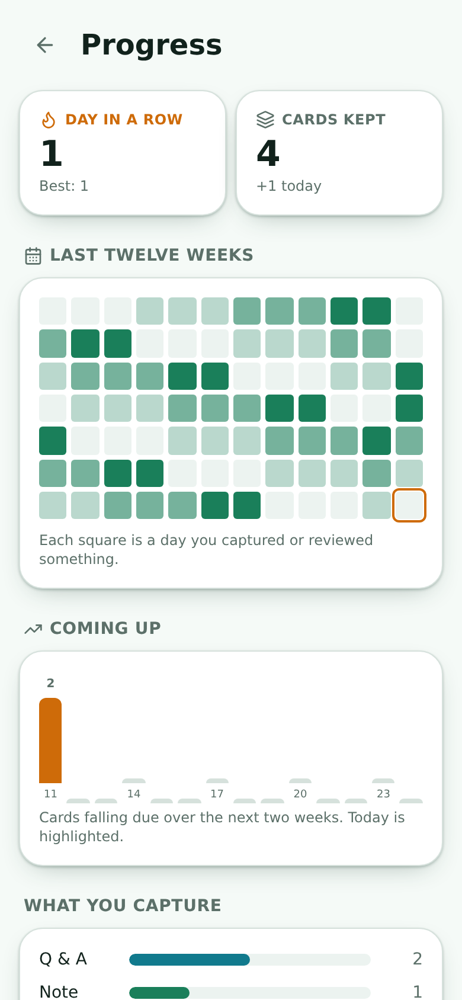
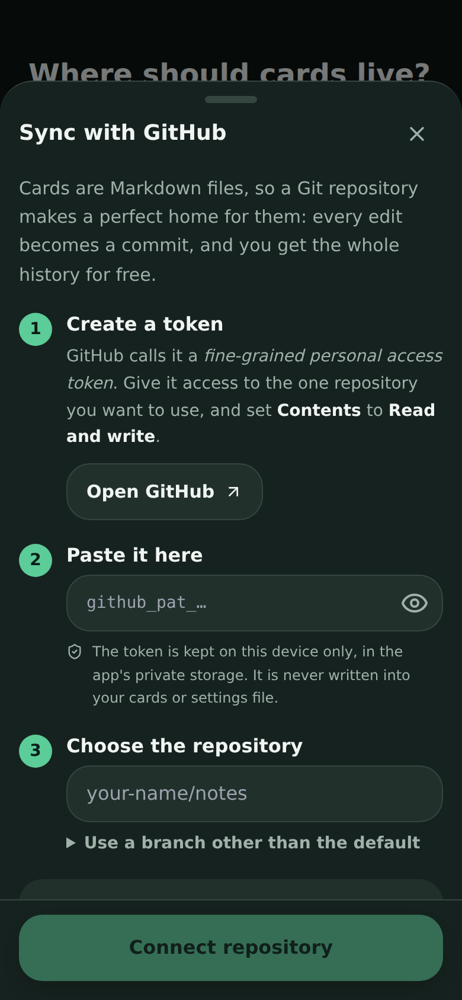

# Micro Card

**Card-style knowledge capture for Android, built with Tauri — every card is a
plain Markdown note in your own Obsidian vault, your own GitHub repository, or
both.**

Write down one idea. Find it again months later. Micro Card is the fastest path
between a thought and a note you actually keep, and it never takes your data
hostage: there is no account, no database and no proprietary format. Cards *are*
files — in the vault you already sync, in a repository you already own, or just
on your phone until you decide otherwise.

<p align="center">
  
  
  
</p>
<p align="center">
  
  
  
</p>

## What it does

| | |
| --- | --- |
| **Capture in seconds** | One big text box, focused before the keyboard finishes animating. Type, hit save. Everything else — kind, tags, deck — is optional and one tap away. A formatting bar means nobody has to know what `**` does. |
| **Five kinds of card** | Note, Q & A, Idea, Quote, To-do. Same file format; only the presentation and whether it comes back for review differ. |
| **Real Obsidian sync** | The vault is the database. Micro Card reads and writes the `.md` files directly, so an edit in Obsidian shows up here and vice versa. |
| **GitHub repository sync** | Or keep the cards in a Git repository: one commit per sync, conflicts resolved by keeping both versions, and full history for free. See [`docs/github-sync.md`](docs/github-sync.md). |
| **Spaced repetition** | Q & A cards come back when you are about to forget them. Three grades, each showing when the card returns — and an undo for the mis-tap. |
| **Study what you choose** | Review everything due, or one deck or tag — including cards that are not due yet, for the night before an exam. |
| **Find things again** | Search with `#tags` and `deck:name`, browse decks and tags, rename either everywhere at once, follow `[[wikilinks]]`, and see what links back. |
| **Share into it** | "Share → Micro Card" from any Android app drops the text straight into the editor, with the page title as the first line. |
| **Bulk tidying** | Swipe a card to star or delete it, or hold one to select a batch and tag, star or delete the lot — with one undo for the batch. |
| **Nothing is final** | Deleted cards wait in *Recently deleted* until you empty the trash, and near-duplicates can be merged into one card rather than hunted down later. |
| **Progress you can see** | A twelve-week activity grid, a two-week forecast of what falls due, a card resurfaced each day, and an optional daily reminder. |
| **Take it elsewhere** | Export as a readable Markdown document, a CSV that Anki imports, or JSON with the review schedules intact. |
| **Nothing to lose** | Drafts survive a crash, deletes are undoable and land in the vault's `.trash`, near-duplicates are flagged before you save, and frontmatter written by other plugins is preserved. |
| **Works before setup** | No vault, no repo, no account? Start capturing anyway. Connect either later and every card moves across. |
| **Readable for everyone** | Green light and dark themes that follow the system, and a text-size setting that scales the whole interface. |

## How the sync works

There is no sync engine, because there is nothing to sync: a card is a file.

```
My Vault/                    ← the folder Obsidian opens
├── .obsidian/               ← how Micro Card recognises a vault
├── .trash/                  ← deleted cards land here, same as Obsidian
└── Cards/                   ← configurable; new cards are written here
    ├── What makes a card atomic.md
    └── Capture beats organising.md
```

Micro Card re-reads the folder on launch and every time the app returns to the
foreground, so anything you (or Obsidian Sync, or Syncthing) changed in the
meantime is picked up. Saving writes the file atomically — temp file, then
rename — so a half-written card can never reach your vault.

See [`docs/card-format.md`](docs/card-format.md) for the file format,
[`docs/obsidian-sync.md`](docs/obsidian-sync.md) for the file-level behaviour,
[`docs/github-sync.md`](docs/github-sync.md) for the repository sync, and
[`docs/sharing-and-trash.md`](docs/sharing-and-trash.md) for the Android share
target, the trash and merging duplicates.

## Sync with a GitHub repository

An alternative to a vault — or an addition to one. Paste a fine-grained token
and `owner/repo`, and Micro Card mirrors the cards folder into that repository:

- **One commit per sync**, built with the Git Data API, no matter how many
  cards changed.
- **Three-way merge** against what the last sync left behind, so only the side
  that actually moved is copied.
- **Conflicts keep both versions** rather than picking a winner, and a card
  deleted here but edited there comes back instead of vanishing.
- **Automatic** on launch, on return to the foreground, and a few seconds after
  a change — or entirely manual, if you prefer.

The token lives in the app's private storage, separate from settings, and never
appears in a card or an error message.

## Getting started

### Requirements

- Node.js 20+
- Rust (stable)
- For Android: JDK 17, the Android SDK and NDK r27, with `ANDROID_HOME` and
  `NDK_HOME` set
- Linux desktop builds also need the usual Tauri system libraries
  (`libwebkit2gtk-4.1-dev`, `libgtk-3-dev`)

### Run it

```sh
npm install

npm run dev            # frontend only, in a browser, with demo data
npm run tauri dev      # the real app on your desktop
```

`npm run dev` in a plain browser runs against an in-memory stub, so you can
click through every screen without a vault.

### Build the Android app

```sh
npm run android:init   # generates gen/android, then patches the manifest
npm run android:dev    # run on a connected device or emulator
npm run android:build  # release APK
```

`src-tauri/gen/android` is generated, not committed. `scripts/patch-android.mjs`
adds what the template does not: storage permissions for reading a vault outside
the app sandbox, legacy external storage for Android 10, `adjustResize` so the
keyboard never covers the editor, and the share-target intent filter plus the
`MainActivity` that receives shared text. Re-run it after any `android init`.

The `Android APK` workflow builds a debug APK on demand or on a `v*` tag.

### Granting storage access on Android

An Obsidian vault normally lives in shared storage, which Android does not open
up by default. After the first launch:

**Settings → Apps → Micro Card → Permissions → Files and media → Allow
management of all files.**

Micro Card checks that the folder is writable when you connect it and says so
immediately if it is not — you will never find out at the first lost card. If
you would rather not grant it, keep using local mode: cards stay in the app's
own storage and can be moved into a vault later without losing anything.

## Project layout

```
src/                     React + Tailwind UI
├── components/          Sheets, toasts, card tiles, editor, Markdown renderer
├── screens/             Onboarding, Home, Library, Browse, Review, Stats, Settings
└── lib/                 Store, backend API, theme, reminders, browser demo fallback

src-tauri/src/           Rust core
├── markdown.rs          Frontmatter + body parsing and serialisation
├── vault.rs             Scanning, atomic writes, trash, vault detection
├── sync.rs              Three-way merge against a `Remote` (tested with a fake)
├── github.rs            The GitHub implementation of that `Remote`
├── state.rs             Settings, card cache, review journal, streaks
├── commands.rs          The commands the UI calls
└── model.rs             Card, Review (SM-2), Settings
```

## Testing

```sh
npm run build                         # typecheck + production bundle
cd src-tauri && cargo test            # 59 tests, no network required
cd src-tauri && cargo clippy --all-targets -- -D warnings
```

The sync engine is tested against an in-memory fake remote (every branch of the
merge table, including the conflict and delete-versus-edit cases), and the
GitHub client against a local mock HTTP server that pins the wire format — the
tree listing, the base64 blob decoding, and the blob → tree → commit → ref
sequence for both an existing branch and an empty repository.

## Design notes

The card metaphor, the tool-grid launcher and the violet/amber palette come from
[cardforge-buddy-creator](https://github.com/jakobgabriel/cardforge-buddy-creator).
That project designed cards to be *printed*; this one designs them to be
*remembered*, and the interface was rebuilt around a thumb rather than a mouse:
one primary action per screen, 48px touch targets, bottom-anchored controls,
swipe-to-grade, undo instead of confirmation dialogs, and no jargon anywhere in
the interface — the words "frontmatter", "YAML" and "vault path" never appear in
front of a first-time user.

The palette is a single green system with one amber accent, defined once as CSS
variables and inverted for dark mode. Text drawn on a brand-coloured fill uses
its own `--brand-ink` token, because a green that is readable behind white text
in daylight is not the same green that works at night.
